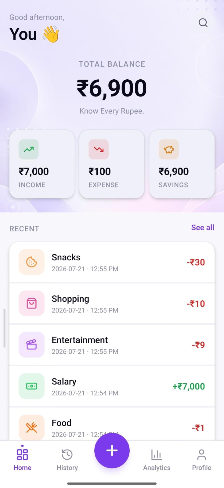
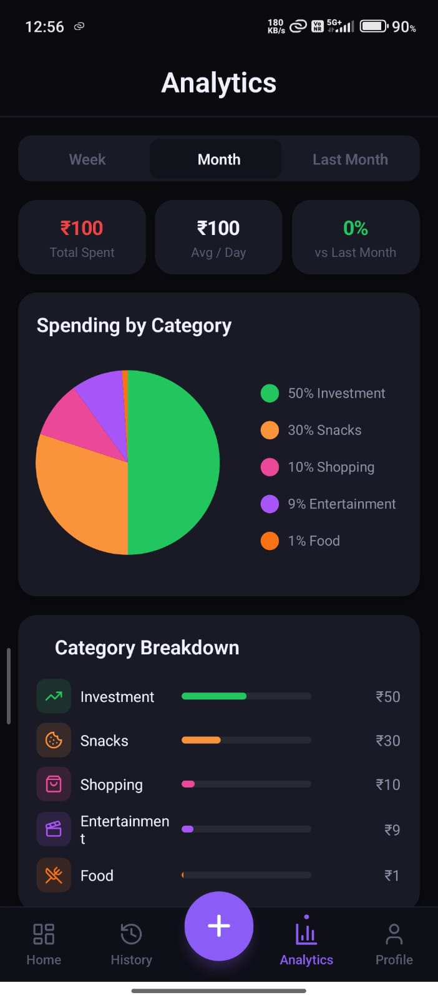

# <p align="center"></p>

<h1 align="center">💜 Pocket</h1>

<p align="center">
<b>Know Every Rupee.</b><br>
A modern personal finance & expense tracker .
</p>

<p align="center">


</p>

---

# 📥 Download APK

<p align="center">

## **[⬇ Download Latest APK](https://github.com/Chetan29hub/POCKETS-/releases/latest/download/Pocket.apk)**

</p>

> Upload **Pocket.apk** to **GitHub Releases** to make the button work automatically.

---

# ✨ About Pocket

Pocket is a modern **offline-first personal finance application** designed to help users manage money with ease.

Whether you're tracking daily expenses, monitoring income, viewing analytics, or splitting expenses with friends, Pocket provides a clean and intuitive experience.

## 🌟 Highlights

- 💰 Track Income & Expenses
- 📊 Beautiful Dashboard
- 📅 Weekly & Monthly Reports
- 📈 Smart Analytics
- 👥 Split Expenses
- 🔒 Secure Local Storage (SQLite)
- ⚡ Fast & Offline
- 🎨 Modern UI

---

# 📸 Screenshots

| Dashboard | Add Expense | Analytics |
|-----------|-------------|-----------|
|  |  |  |

---

# 🚀 Features

## 💰 Expense Management

- Add expenses
- Income tracking
- Categories
- Balance management
- Transaction history

## 📊 Analytics

- Spending insights
- Monthly reports
- Weekly reports
- Category breakdown
- Charts

## 👥 Split Bills

- Split expenses with friends
- Automatic share calculation

## 🔒 Privacy

- Offline first
- SQLite Database
- No account required
- Your data stays on your device

---

# 📊 Project Status

| Feature | Status |
|----------|--------|
| Dashboard | ✅ |
| Expense Tracking | ✅ |
| Analytics | ✅ |
| Split Expenses | ✅ |
| SQLite | ✅ |
| Offline | ✅ |
| Search | ✅ |

---

# 🛠 Tech Stack

- React Native
- Expo
- TypeScript
- SQLite
- React Navigation
- Expo Vector Icons

---

# 📂 Project Structure

```text
Pocket
├── assets
│   └── screenshots
├── src
├── App.tsx
├── package.json
└── README.md
```

---

# ⚙️ Installation

```bash
git clone https://github.com/Chetan29hub/POCKETS-.git
cd POCKETS-
npm install
npx expo start
```

---

# 🗺️ Roadmap

- ✅ Expense Tracking
- ✅ Dashboard
- ✅ Analytics
- ✅ Split Expenses
- ⏳ Budget Planner
- ⏳ Cloud Backup
- ⏳ Notifications
- ⏳ PDF Export
- ⏳ Biometric Lock
- ⏳ AI Spending Insights

---

# 👨‍💻 Developer

**Chetan Pathe**

- AI Engineering Student
GitHub: https://github.com/Chetan29hub

---

# 🤝 Contributing

Contributions are welcome!

1. Fork the repository
2. Create a feature branch
3. Commit your changes
4. Open a Pull Request

---

# ⭐ Support

If you like this project:

- ⭐ Star the repository
- 🍴 Fork the project
- 📢 Share it with others


